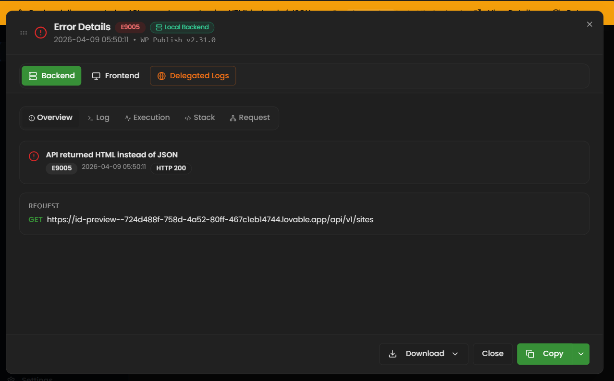

# Modal Structure & Components

> **Parent:** [Error Modal Reference](./00-overview.md)  
> **Version:** 2.3.0  
> **Updated:** 2026-04-09

---

## Visual Reference

The following screenshot shows the **Backend → Overview** tab for an E9005 error. Use this as the ground-truth layout reference when implementing the modal.



**Key elements visible in the screenshot (top → bottom):**

1. **DialogHeader** — Title text "Error Details", error-code badge (`E9005`, red), environment badge (`Local Backend`, green outline), timestamp + app version (`2026-04-09 05:50:11 • WP Publish v2.31.0`).
2. **Section Toggle** — Three pill-style buttons: `Backend` (filled/active, green icon), `Frontend` (ghost), `Delegated Logs` (ghost, green globe icon). The third section only appears when delegated-server data exists in the error.
3. **Backend Tab Bar** — Horizontal tabs: `Overview` (active), `Log`, `Execution`, `Stack`, `Request`. The `Session` and `Traversal` tabs are **conditionally rendered** (Session appears only when `sessionId` is present; Traversal appears only when envelope traversal data exists).
4. **Overview Content** — Two cards:
   - **Error Card** — Alert icon (orange), error message (`API returned HTML instead of JSON`), error-code badge (`E9005`, dark), timestamp, HTTP status badge (`HTTP 200`).
   - **Request Card** — Label `REQUEST`, HTTP method badge (`GET`, green), full request URL.
5. **DialogFooter** — Three actions: `Download` (dropdown with chevron), `Close` (ghost button), `Copy` (green split-button with chevron dropdown).

---

## Component Hierarchy

```
GlobalErrorModal.tsx
├── DialogHeader
│   ├── Title: "Error Details" (static text)
│   ├── Error code badge (e.g., [E9005], red background)
│   ├── Environment badge (e.g., [Local Backend], green outline)
│   ├── Timestamp + app version (gray text, monospace)
│   └── Queue navigation [◀ 1/3 ▶] (only when multiple errors)
│
├── Section Toggle (3 buttons, pill-style)
│   ├── Backend (server icon, always shown)
│   ├── Frontend (monitor icon, always shown)
│   └── Delegated Logs (globe icon, green — conditional: only when delegated data exists)
│
├── ScrollArea (flex-1, contains active section)
│   ├── BackendSection.tsx (when activeSection === "backend")
│   │   ├── Tabs (conditional visibility — see "Tab Visibility Rules" below)
│   │   │   ├── Overview (error message, request info, timing, badges)
│   │   │   ├── Log (error.log.txt content)
│   │   │   ├── Execution (Go call chain table + session logs)
│   │   │   ├── Stack (Go + PHP stack traces, session diagnostics)
│   │   │   ├── Session (only when sessionId exists)
│   │   │   ├── Request (request chain visualization)
│   │   │   └── Traversal (only when envelope traversal data exists)
│   │   └── (Internal sub-components: OverviewContent, ErrorLogContent, etc.)
│   │
│   ├── FrontendSection.tsx (when activeSection === "frontend")
│   │   ├── Tabs
│   │   │   ├── Overview (trigger context, message, call chain, click path)
│   │   │   ├── Stack (parsed/raw JS stack, React execution chain)
│   │   │   ├── Context (full error context JSON)
│   │   │   └── Fixes (suggested fixes by error code)
│   │   └── (Internal sub-components)
│   │
│   └── DelegatedLogsSection.tsx (when activeSection === "delegated")
│       └── Delegated server logs, stack traces, response details
│
├── DialogFooter
│   ├── DownloadDropdown (ZIP bundle, error.log.txt, log.txt, report.md)
│   ├── Close button (ghost style)
│   └── CopyDropdown (Split Button: main = compact report, chevron = full report, backend logs, error.log.txt, log.txt)
│
└── ErrorModalTypes.ts (shared types: PHPStackFrame, AppInfo, SectionCommonProps)
```

### Tab Visibility Rules

| Tab | Condition | Data Source |
|-----|-----------|-------------|
| Overview | Always visible | Core error fields |
| Log | Always visible | `error.log.txt` fetch |
| Execution | Always visible | `envelopeMethodsStack`, `backendLogs` |
| Stack | Always visible | `envelopeErrors.Backend`, `phpStackFrames` |
| Session | `sessionId` is truthy | Session API fetch |
| Request | Always visible | `endpoint`, `method`, request chain |
| Traversal | `envelopeMethodsStack` or `envelopeErrors.DelegatedRequestServer` exists | Envelope data |

---

## Visual Layout Diagrams

### Full Modal Layout (Desktop: 95vw × 95vh)

```
┌─────────────────────────────────────────────────────────────────────┐
│ ┌─ DialogHeader ──────────────────────────────────────────────────┐ │
│ │ ⚠ Error Details  [E9005]  [🖥 Local Backend]                   │ │
│ │ 2026-04-09 05:50:11 • WP Publish v2.31.0     [◀ 1/3 ▶]        │ │
│ └─────────────────────────────────────────────────────────────────┘ │
│ ┌─ Section Toggle ────────────────────────────────────────────────┐ │
│ │  [🖥 Backend]  [💻 Frontend]  [🌐 Delegated Logs]              │ │
│ └─────────────────────────────────────────────────────────────────┘ │
│ ┌─ ScrollArea (flex-1) ──────────────────────────────────────────┐ │
│ │ ┌─ Tab Bar (conditional tabs) ──────────────────────────────┐  │ │
│ │ │ Overview │ Log │ Execution │ Stack │ Request               │  │ │
│ │ └───────────────────────────────────────────────────────────┘  │ │
│ │                                                                │ │
│ │  ┌─ Active Tab Content ─────────────────────────────────────┐  │ │
│ │  │                                                          │  │ │
│ │  │  (Tab-specific content rendered here)                    │  │ │
│ │  │                                                          │  │ │
│ │  └──────────────────────────────────────────────────────────┘  │ │
│ └────────────────────────────────────────────────────────────────┘ │
│ ┌─ DialogFooter ─────────────────────────────────────────────────┐ │
│ │  [⬇ Download ▼]                        [Close] [📋 Copy ▼]    │ │
│ └─────────────────────────────────────────────────────────────────┘ │
└─────────────────────────────────────────────────────────────────────┘
```

### Backend Section — Overview Tab

> **Reference:** See screenshot above for ground-truth layout.

```
┌──────────────────────────────────────────────────────────────────┐
│  ┌─ Error Card (rounded border, left-aligned) ──────────────────┐ │
│  │  ⚠ (orange icon)                                             │ │
│  │  API returned HTML instead of JSON                           │ │
│  │  [E9005] (dark badge)   2026-04-09 05:50:11   [HTTP 200]     │ │
│  └──────────────────────────────────────────────────────────────┘ │
│                                                                    │
│  ┌─ Request Card (rounded border) ──────────────────────────────┐ │
│  │  REQUEST (uppercase label, muted)                             │ │
│  │  [GET] (green badge)  https://id-preview--724d.../api/v1/sites│ │
│  └──────────────────────────────────────────────────────────────┘ │
│                                                                    │
│  (The following sections appear conditionally based on data)       │
│                                                                    │
│  ┌─ Backend Error Banner (red-themed, conditional) ─────────────┐ │
│  │  ⚠ Backend Error: <envelopeErrors.BackendMessage>            │ │
│  └──────────────────────────────────────────────────────────────┘ │
│                                                                    │
│  ┌─ Delegated Info Banner (blue, conditional) ──────────────────┐ │
│  │  ℹ <DelegatedRequestServer.AdditionalMessages>               │ │
│  └──────────────────────────────────────────────────────────────┘ │
│                                                                    │
│  ┌─ Timing (conditional: when requestedAt/requestDelegatedAt) ──┐ │
│  │  Requested At:    /api/v1/plugins/enable                      │ │
│  │  Delegated At:    https://site.com/wp-json/...                │ │
│  └──────────────────────────────────────────────────────────────┘ │
│                                                                    │
│  ┌─ Availability Badges (conditional per field) ────────────────┐ │
│  │  [✓ Session] [✓ Stack Traces] [✓ Delegated Info] [✓ Exec]    │ │
│  └──────────────────────────────────────────────────────────────┘ │
└──────────────────────────────────────────────────────────────────┘
```

**Overview Tab — Rendering Rules:**

| Element | Condition | Notes |
|---------|-----------|-------|
| Error Card | Always | Message from `error.message`, code from `error.code`, status from `error.responseStatus` |
| Request Card | `error.endpoint` exists | Method badge color: GET=green, POST=blue, PUT=amber, DELETE=red |
| Backend Error Banner | `envelopeErrors.BackendMessage` exists | Red-themed alert |
| Delegated Info Banner | `DelegatedRequestServer.AdditionalMessages` exists | Blue-themed info |
| Timing section | `requestedAt` or `requestDelegatedAt` exists | Monospace font |
| Availability Badges | Per-field check | Green check = data present, gray = absent |

### Backend Section — Stack Tab

```
┌──────────────────────────────────────────────────────────────────┐
│  ┌─ Go Backend Stack (blue-themed) ───────────────────────────┐  │
│  │  site_handlers.go:327  handlers.EnableRemotePlugin          │  │
│  │  service.go:1245       site.(*Service).EnableRemotePlugin   │  │
│  └─────────────────────────────────────────────────────────────┘  │
│                                                                  │
│  ┌─ Delegated Server Stack (purple-themed, NEW v2.0.0) ───────┐  │
│  │  ┌─ Header ─────────────────────────────────────────────┐   │  │
│  │  │ 🟣 Delegated Server  GET  403                        │   │  │
│  │  │ https://example.com/wp-json/riseup.../snapshots/...  │   │  │
│  │  └──────────────────────────────────────────────────────┘   │  │
│  │  Stack Trace:                                               │  │
│  │  #0 riseup-asia-uploader.php(1098): Logger->error()         │  │
│  │  #1 class-wp-hook.php(341): Plugin->enrichError()          │  │
│  │  #2 plugin.php(205): WP_Hook->apply_filters()               │  │
│  │  Response:                                                  │  │
│  │  ▸ { "code": "rest_forbidden", "message": "...", ... }     │  │
│  └─────────────────────────────────────────────────────────────┘  │
│                                                                  │
│  ┌─ PHP Delegated Stack (orange-themed, legacy) ───────────────┐  │
│  │  PHP Fatal error: Class 'PDO' not found in plugin-mgr.php  │  │
│  │  #0 endpoints.php(15): PluginManager->connect()             │  │
│  │  #1 {main}                                                  │  │
│  └─────────────────────────────────────────────────────────────┘  │
│                                                                  │
│  ┌─ PHP Structured Frames (table) ────────────────────────────┐  │
│  │  #  │ Function                    │ File              │ Line│  │
│  │  0  │ PluginManager::connect()    │ plugin-mgr.php    │ 42  │  │
│  │  1  │ handle_enable()             │ endpoints.php     │ 15  │  │
│  └─────────────────────────────────────────────────────────────┘  │
│                                                                  │
│  ┌─ Session Diagnostics (auto-fetched) ───────────────────────┐  │
│  │  Go frames: 3 │ PHP frames: 2 │ stacktrace.txt: available  │  │
│  └─────────────────────────────────────────────────────────────┘  │
└──────────────────────────────────────────────────────────────────┘
```

### Backend Section — Request Tab (Chain Visualization)

```
┌──────────────────────────────────────────────────────────────────┐
│  ┌─ Node 1: React → Go ──────────────────────────────────────┐  │
│  │  🔵 [React → Go]  [POST]  [500]                           │  │
│  │  /api/v1/plugins/enable                                    │  │
│  │  ▸ Request Body: { "slug": "my-plugin", "SiteId": 1 }     │  │
│  └──────────┬─────────────────────────────────────────────────┘  │
│             │ (vertical connector line)                           │
│  ┌──────────┴─────────────────────────────────────────────────┐  │
│  │  🟠 [Go → Delegated]  [GET]  [403]                        │  │
│  │  https://example.com/wp-json/riseup.../v1/snapshots/...    │  │
│  │  ▸ Request Body: (none — GET)                              │  │
│  └──────────┬─────────────────────────────────────────────────┘  │
│             │ (vertical connector line)                           │
│  ┌──────────┴─────────────────────────────────────────────────┐  │
│  │  🟣 [Delegated Response]  (NEW v2.0.0)                     │  │
│  │  ▸ Response: { "code": "rest_forbidden", "message": ... }  │  │
│  │  ▸ Stack Trace: #0 riseup-asia-uploader.php(1098)...       │  │
│  │  ▸ Additional: Endpoint 'snapshots' is not enabled...      │  │
│  └────────────────────────────────────────────────────────────┘  │
│                                                                  │
│  ┌─ Environment ──────────────────────────────────────────────┐  │
│  │  API Base: http://localhost:8080   VITE_API_URL: ...        │  │
│  └────────────────────────────────────────────────────────────┘  │
└──────────────────────────────────────────────────────────────────┘
```

### Backend Section — Traversal Tab

```
┌──────────────────────────────────────────────────────────────────┐
│  ┌─ Endpoint Flow (3-hop, NEW v2.0.0) ─────────────────────────┐ │
│  │  [React] http://localhost:8080                               │ │
│  │    ──▸                                                      │ │
│  │  [Go] /api/v1/sites/1/snapshots/settings                    │ │
│  │    ──▸                                                      │ │
│  │  [Delegated] https://site.com/wp-json/riseup.../settings    │ │
│  │              GET → 403                                      │ │
│  └────────────────────────────────────────────────────────────┘  │
│                                                                  │
│  ┌─ Methods Stack (table) ────────────────────────────────────┐  │
│  │  #  │ Method                          │ File            │ Ln│  │
│  │  1  │ handlers.handleSiteActionById   │ handler_factory │107│  │
│  │  2  │ api.SessionLogging              │ session_log     │107│  │
│  │  3  │ api.Recovery                    │ middleware      │245│  │
│  └────────────────────────────────────────────────────────────┘  │
│                                                                  │
│  ┌─ Delegated Server Details (purple, NEW v2.0.0) ─────────────┐ │
│  │  Endpoint: https://site.com/wp-json/riseup.../settings      │ │
│  │  Method: GET │ Status: 403                                  │ │
│  │  Stack Trace:                                                │ │
│  │    #0 riseup-asia-uploader.php(1098): Logger->error()       │ │
│  │    #1 class-wp-hook.php(341): enrichErrorResponse()       │ │
│  │  Additional: Endpoint not enabled in plugin settings        │ │
│  └────────────────────────────────────────────────────────────┘  │
│                                                                  │
│  ┌─ Delegated Service Error Stack (orange, legacy) ────────────┐ │
│  │  PHP Fatal error: Class 'PDO' not found...                  │ │
│  │  #0 endpoints.php(15): PluginManager->connect()             │ │
│  └────────────────────────────────────────────────────────────┘  │
└──────────────────────────────────────────────────────────────────┘
```

### Frontend Section — Overview Tab

```
┌──────────────────────────────────────────────────────────────────┐
│  ┌─ Trigger Context ──────────────────────────────────────────┐  │
│  │  Component: PluginCard  →  Action: enable_clicked           │  │
│  └────────────────────────────────────────────────────────────┘  │
│                                                                  │
│  ┌─ Message ──────────────────────────────────────────────────┐  │
│  │  Failed to enable plugin "my-plugin" on site                │  │
│  └────────────────────────────────────────────────────────────┘  │
│                                                                  │
│  ┌─ Call Chain ───────────────────────────────────────────────┐  │
│  │  PluginsPage                                                │  │
│  │    └─ usePluginActions.enable                               │  │
│  │        └─ api.post("/api/v1/plugins/enable")                │  │
│  └────────────────────────────────────────────────────────────┘  │
│                                                                  │
│  ┌─ User Interaction Path (last 10 clicks) ───────────────────┐  │
│  │  14:31:55  PluginsPage     "Plugins" tab       click  /    │  │
│  │  14:31:58  PluginCard      "Enable" button     click  /    │  │
│  │  14:32:01  PluginCard      "Confirm" button    click  /    │  │
│  └────────────────────────────────────────────────────────────┘  │
└──────────────────────────────────────────────────────────────────┘
```

### Frontend Section — Stack Tab

```
┌──────────────────────────────────────────────────────────────────┐
│  [● Parsed] [○ Raw]                    [□ Show internal frames] │
│                                                                  │
│  ┌─ Parsed Stack Frames (table) ──────────────────────────────┐  │
│  │  #  │ Function              │ File                │ Line   │  │
│  │  0  │ enablePlugin          │ usePluginActions.ts  │ 45    │  │
│  │  1  │ handleClick           │ PluginCard.tsx       │ 112   │  │
│  │  2  │ callCallback          │ react-dom.js         │ 3942  │  │
│  └────────────────────────────────────────────────────────────┘  │
│                                                                  │
│  ┌─ React Execution Chain ────────────────────────────────────┐  │
│  │  [render] PluginsPage                           14:31:50   │  │
│  │  [effect] usePluginActions                      14:31:51   │  │
│  │  [handler] enablePlugin                         14:32:01   │  │
│  └────────────────────────────────────────────────────────────┘  │
│                                                                  │
│  Error Location: usePluginActions.ts:45 in enablePlugin()        │
└──────────────────────────────────────────────────────────────────┘
```

### DialogFooter — Action Menus

The **Copy** button uses a **Split Button** pattern: the main button area copies the **Compact Report** instantly (no API call), while the chevron arrow opens a dropdown with all copy options.

```
┌──────────────────────────────────────────────────────────────────┐
│  [▼ Download]                       [Close]  [ Copy ][▼]        │
│  ┌─────────────────┐                    ┌──────────────────────┐│
│  │ Full Bundle (ZIP)│        main click: │ (copies compact)     ││
│  │ error.log.txt    │        chevron ▼:  │ Compact Report       ││
│  │ log.txt          │                    │ Full Report          ││
│  │ Report (.md)     │                    │ With Backend Logs    ││
│  └─────────────────┘                    │ error.log.txt        ││
│                                         │ log.txt              ││
│                                         └──────────────────────┘│
└──────────────────────────────────────────────────────────────────┘
```

The **ErrorDetailModal** (standalone viewer used on E2E Tests page) uses the same Split Button pattern via an `errorLogAdapter.ts` bridge.

### Full-Screen Layout

```tsx
<DialogContent className={cn(
  "flex flex-col p-0 gap-0 overflow-hidden",
  "w-full h-full max-w-full max-h-full rounded-none",          // Mobile: full screen
  "sm:max-w-[95vw] sm:w-[95vw] sm:max-h-[95vh] sm:h-[95vh] sm:rounded-lg",  // Desktop
  "lg:max-w-6xl"
)}>
```

---

*Modal structure — updated: 2026-04-09*
