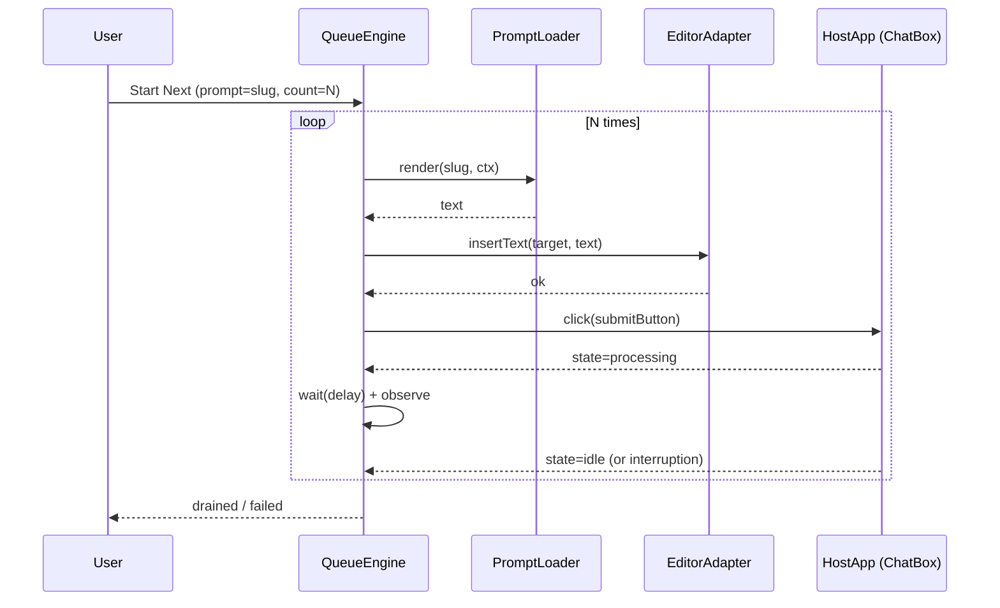

# 01 — Next-Automation Overview

**Date:** 2026-06-02
**Task:** T61

## Purpose

**Next mode** repeatedly injects the same prompt into the ChatBox and presses the host's submit button N times, observing for completion or interruption between iterations. It is the simplest queue consumer; **Plan mode** (Step 14) reuses the same engine with a different prompt template.

## Sequence (one iteration)

## Required host wiring

| Host concern | Spec reference |
|--------------|----------------|
| ChatBox target | `06-injection-contract/01-target-resolution.md` |
| Submit button | `02-host-submit-button.md` (this folder) |
| Busy/idle signal | `04-interruption-detection.md` |
| Cancel surface | `05-cancel.md` |

## Out of scope

- Streaming response parsing.
- Cost/credit tracking (consumer-level concern).
- Multi-tab coordination (single tab owns the queue).

## Acceptance

- [ ] The implementation satisfies the `01 — Next-Automation Overview` contract in this file and the folder-level acceptance target: NextLoop submission, disabled-button handling, interruption, and cancellation behavior is deterministic.
- [ ] Verification passes when `E2E-next-001..005` passes, and `node scripts/audit/check-acceptance.mjs --root=spec/2026-spec` reports this file has a machine-checkable acceptance contract.

<!-- audit: determinism+pitfalls footer -->

## Determinism Notes

- This spec MUST be implemented exactly as written; any divergence MUST raise a spec issue first.
- Numeric defaults (timeouts, retries, sizes) MUST be sourced from `reference/05-runtime-defaults.md`; prose MUST cite constant names, not duplicate numeric values.
- All boolean toggles MUST have an explicit default of `false` unless the runtime-defaults table specifies otherwise.
- Implementations MUST treat undocumented states as a hard error and SHALL log via the namespace logger.

## Pitfalls

- **Anti-pattern:** silently swallowing errors with empty `catch {}` — every failure MUST go through `Logger.error()` with `Reason` + `ReasonDetail`.
- **Edge case:** new-tab / blank navigations (`about:blank`, `chrome://newtab/`) — gate every entry point with `isNewTabOrBlankUrl()`.
- **Counter-example:** hardcoding a timezone string (e.g. `Asia/Kuala_Lumpur`) — always render in the user's local timezone via `Intl.DateTimeFormat().resolvedOptions().timeZone`.
- **Gotcha:** assuming Chrome `storage.local` is synchronous — it is async and MUST be awaited; never read it during top-level module evaluation.

<!-- audit: uplift-to-100 footer -->

## Audit Anchors (source-of-truth)

- Implementations MUST honor every numeric default declared in [runtime defaults](../reference/05-runtime-defaults.md); see also [related](../readme.md).
- Runtime-default values MUST be read from named constants in `reference/05-runtime-defaults.md`, not copied into prose examples.
- Any deviation MUST raise a spec issue before code is shipped (`60 s` review window minimum).

---

> Owner: see [`next` command convention](mem://preferences/next-command-convention) for the authoritative rule backing the MUST/SHALL statements in this file.
