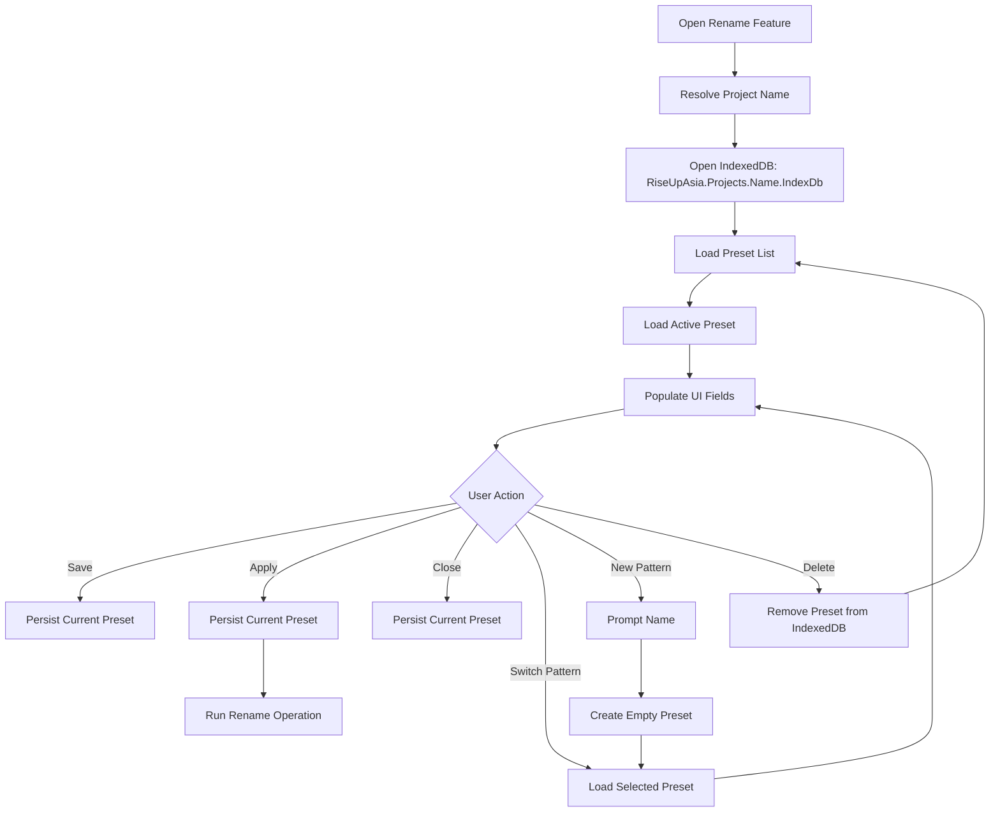

# Spec: Rename Persistence via Project-Scoped IndexedDB

**Status**: READY v1.0.0  
**Created**: 2026-04-08  
**Module**: `standalone-scripts/macro-controller/src/`  
**Affects**: `ui/bulk-rename.ts`, `ui/bulk-rename-fields.ts`, new files below

---

## 1. Overview

Add persistent save/restore for bulk rename configurations using a **project-scoped IndexedDB** namespace. Users can create, switch, and manage multiple named rename patterns (presets). The storage layer is generic and reusable by any plugin or script.

## 2. Architecture

### 2.1 Generic KV Store — `project-kv-store.ts`

A reusable IndexedDB key-value persistence layer, project-scoped.

```
DB Name:  RiseUpAsia.Projects.<ProjectName>.IndexDb
Version:  1
Store:    kv  (keyPath: "key")
```

**API surface:**

```typescript
interface ProjectKvStore {
  get<T = unknown>(section: string, key: string): Promise<T | null>;
  set<T = unknown>(section: string, key: string, value: T): Promise<void>;
  delete(section: string, key: string): Promise<void>;
  list(section: string): Promise<Array<{ key: string; value: unknown }>>;
  getAll(section: string): Promise<Record<string, unknown>>;
}

function getProjectKvStore(projectName: string): ProjectKvStore;
```

- **Section** groups keys logically (e.g. `MacroController.Rename`, `MacroController.Settings`).
- Compound key stored as `${section}::${key}` in the object store.
- Each record: `{ key: string, section: string, value: any, updatedAt: number }`.

### 2.2 Rename Preset Store — `rename-preset-store.ts`

Higher-level API over `ProjectKvStore` for rename presets.

```typescript
interface RenamePreset {
  name: string;
  template: string;
  prefix: string;
  prefixEnabled: boolean;
  suffix: string;
  suffixEnabled: boolean;
  startDollar: number;
  startHash: number;
  startStar: number;
  delayMs: number;
  createdAt: number;
  updatedAt: number;
}

interface RenamePresetStore {
  listPresets(): Promise<string[]>;
  getActivePresetName(): Promise<string>;
  setActivePresetName(name: string): Promise<void>;
  loadPreset(name: string): Promise<RenamePreset | null>;
  savePreset(name: string, preset: RenamePreset): Promise<void>;
  deletePreset(name: string): Promise<void>;
}
```

**Storage keys** (section = `MacroController.Rename`):

| Key | Value |
|-----|-------|
| `_activePattern` | `string` — name of currently selected preset |
| `Default` | `RenamePreset` (serialized) |
| `CustomA` | `RenamePreset` (serialized) |
| ... | ... |

### 2.3 Project Name Resolution

Use existing `loopCreditState.currentWorkspaceName` or derive from the active workspace context. The project name is sanitized (alphanumeric + hyphens) for use in the DB name.

## 3. UI Changes — `bulk-rename.ts`

### 3.1 Preset Selector (new row at top of panel body)

- A `<select>` dropdown showing all saved presets + a "➕ New..." option.
- Switching presets loads the associated `RenamePreset` and populates all fields.
- "➕ New..." prompts for a name, creates a new empty preset, and selects it.

### 3.2 Save Button

- New "💾 Save" button in the button row.
- Persists current UI values to the active preset.
- Shows a toast on success.

### 3.3 Auto-Save on Apply and Close

- `applyBtn.onclick` → save current config before executing rename.
- `closeBtnTitle.onclick` and `cancelBtn.onclick` → save current config before closing panel.
- `removeBulkRenameDialog()` → save current config.

### 3.4 Auto-Load on Open

- `renderBulkRenameDialog()` → after building UI, load active preset and populate fields.
- If no saved preset exists, fields remain empty (current behavior).

### 3.5 Delete Preset

- A small "🗑" button next to the dropdown to delete the selected preset (with confirmation).
- Cannot delete the last remaining preset (at least "Default" must exist).

## 4. File Plan

| File | Action | Description |
|------|--------|-------------|
| `src/project-kv-store.ts` | **NEW** | Generic project-scoped IndexedDB KV store |
| `src/rename-preset-store.ts` | **NEW** | Rename preset CRUD over project KV store |
| `src/ui/bulk-rename.ts` | **MODIFY** | Add preset dropdown, save button, auto-save/load |
| `src/ui/bulk-rename-fields.ts` | **MODIFY** | Add `buildPresetRow()` helper |
| `src/types.ts` | **MODIFY** | Add `RenamePreset` type |
| `src/workspace-rename.ts` | **MODIFY** | Re-export preset store for barrel compatibility |

All paths relative to `standalone-scripts/macro-controller/`.

## 5. Execution Flow

### 5.1 Open Rename Panel

```
renderBulkRenameDialog()
  → resolve project name
  → getProjectKvStore(projectName)
  → getRenamePresetStore(projectName)
  → listPresets() → populate dropdown
  → getActivePresetName() → select in dropdown
  → loadPreset(activeName) → populate UI fields
  → build rest of panel (existing logic)
```

### 5.2 Save

```
User clicks "💾 Save"
  → read all UI field values
  → build RenamePreset object
  → savePreset(selectedName, preset)
  → toast "Saved"
```

### 5.3 Apply

```
User clicks "✅ Apply"
  → auto-save current config (same as Save)
  → execute existing rename logic (unchanged)
```

### 5.4 Close / Cancel

```
User clicks "✕" or "Cancel"
  → auto-save current config
  → removeBulkRenameDialog() (existing)
```

### 5.5 Switch Pattern

```
User selects different preset in dropdown
  → loadPreset(newName)
  → populate UI fields
  → setActivePresetName(newName)
```

### 5.6 New Pattern

```
User selects "➕ New..."
  → prompt for name
  → savePreset(name, defaultValues)
  → add to dropdown, select it
```

## 6. Reusability Contract

The `ProjectKvStore` is intentionally generic:

```typescript
// Any plugin can store its own config:
const store = getProjectKvStore('MyProject');
await store.set('PromptManager.Settings', 'fontSize', 14);
await store.set('AutoAttach.Config', 'enabled', true);
const val = await store.get<number>('PromptManager.Settings', 'fontSize');
```

Plugins use their own section prefix. No collision possible.

## 7. Migration from localStorage

The rename history (`ml_rename_history`) currently uses `localStorage`. This spec does NOT migrate that — it remains in localStorage. Only the rename **configuration/presets** use IndexedDB.

## 8. Error Handling

- IndexedDB unavailable → log error with exact path (`[RenamePresetStore] IndexedDB open failed for DB "RiseUpAsia.Projects.{name}.IndexDb": {error}`), fall back to in-memory defaults.
- Corrupted preset JSON → log warning, return default preset.
- Missing preset on load → return null, UI uses empty fields.

## 9. Acceptance Criteria

1. Opening rename panel auto-loads last saved preset values.
2. Clicking Save persists current config to IndexedDB.
3. Clicking Apply auto-saves before executing.
4. Clicking Close/Cancel auto-saves before closing.
5. Dropdown lists all saved presets + "➕ New...".
6. Switching presets loads correct values.
7. Deleting a preset removes it from IndexedDB and dropdown.
8. Storage is project-scoped (different projects have independent presets).
9. `ProjectKvStore` is reusable by other scripts (no rename-specific assumptions).
10. Error logs include exact DB name, store, key, and reason.

## 10. Diagram


