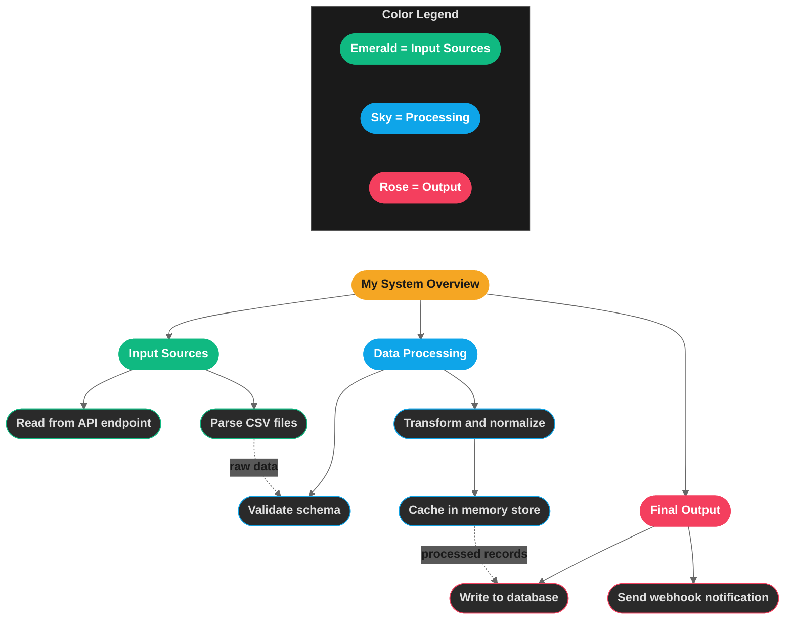

# Mermaid Diagram Design System — Complete Reference

> **Purpose**: This document is a self-contained guide for any AI or human to produce visually consistent Mermaid diagrams matching our project's XMind-inspired dark-mode aesthetic. Follow every rule exactly — no improvisation on colors, shapes, or structure.

---

## 1. Global Settings

Every `.mmd` file **MUST** begin with this exact init block (no modifications):

```mermaid
%%{init: {'theme': 'dark', 'themeVariables': {'darkMode': true, 'background': '#222222', 'primaryColor': '#F5A623', 'primaryTextColor': '#1a1a1a', 'lineColor': '#666', 'fontSize': '13px'}}}%%
```

| Property | Value | Notes |
|----------|-------|-------|
| Theme | `dark` | Always dark mode |
| Background | `#222222` | Charcoal dark canvas |
| Primary color | `#F5A623` | Amber — used for root node |
| Primary text | `#1a1a1a` | Near-black text on amber |
| Line color | `#666` | Medium gray connectors |
| Font size | `13px` | Base font size |

---

## 2. Layout

- **Direction**: Always `flowchart TD` (top-down vertical flow)
- **Never** use `LR`, `RL`, or `BT` for the main diagram
- The legend subgraph uses `direction LR` or `direction TB` internally

---

## 3. Color Palette — 6 Branch Colors + Root

### 3.1 Root Node

The topmost node of every diagram. Always amber, always bold, larger font.

| Property | Value |
|----------|-------|
| Fill | `#F5A623` |
| Stroke | `#F5A623` |
| Text color | `#1a1a1a` (dark) |
| Stroke width | `0px` |
| Font weight | `bold` |
| Font size | `15px` |

```mermaid
classDef root fill:#F5A623,stroke:#F5A623,color:#1a1a1a,stroke-width:0px,font-weight:bold,font-size:15px
```

### 3.2 Branch Colors (Heading + Sub-node pairs)

Each branch in the diagram uses **two** classDefs: a colored **heading** class and a dark **sub-node** class.

| Slot | Name | Hex | Heading Text | Sub Fill | Sub Border | Sub Text | Semantic Use |
|------|------|-----|-------------|----------|------------|----------|--------------|
| 1 | **Emerald** | `#10B981` | `#fff` | `#2a2a2a` | `#10B981` | `#e0e0e0` | Sources, inputs, triggers, public APIs |
| 2 | **Sky** | `#0EA5E9` | `#fff` | `#2a2a2a` | `#0EA5E9` | `#e0e0e0` | Processing, scanning, resolution |
| 3 | **Rose** | `#F43F5E` | `#fff` | `#2a2a2a` | `#F43F5E` | `#e0e0e0` | Critical paths, bridges, fallbacks |
| 4 | **Amber** | `#F59E0B` | `#1a1a1a` | `#2a2a2a` | `#F59E0B` | `#e0e0e0` | Outputs, success states, consumers |
| 5 | **Violet** | `#8B5CF6` | `#fff` | `#2a2a2a` | `#8B5CF6` | `#e0e0e0` | Internal ops, deploy, monitoring |
| 6 | **Cyan** | `#06B6D4` | `#fff` | `#2a2a2a` | `#06B6D4` | `#e0e0e0` | UI, sync, broadcast, dynamic |

> **Note**: Amber heading text is `#1a1a1a` (dark on bright yellow). All other headings use `#fff` (white on dark colors).

### 3.3 Visual Hierarchy

```
┌──────────────────────────────────────────────────┐
│  Root Node (Amber #F5A623, dark text, no stroke) │  ← Level 0
└─────────────────────┬────────────────────────────┘
                      │
        ┌─────────────┼─────────────┐
        ▼             ▼             ▼
┌──────────────┐ ┌──────────┐ ┌──────────────┐
│ Branch Head  │ │ Branch   │ │ Branch Head  │  ← Level 1
│ (Solid fill, │ │ Head     │ │ (Solid fill, │    Colored background
│  bold, 2px)  │ │          │ │  bold, 2px)  │    White/dark text
└──────┬───────┘ └────┬─────┘ └──────┬───────┘
       ▼              ▼              ▼
┌──────────────┐ ┌──────────┐ ┌──────────────┐
│ Sub-node     │ │ Sub-node │ │ Sub-node     │  ← Level 2+
│ (Dark fill   │ │          │ │ (Dark fill   │    #2a2a2a background
│  #2a2a2a,    │ │          │ │  thin colored │    Light #e0e0e0 text
│  1px border) │ │          │ │  border)     │    1px colored stroke
└──────────────┘ └──────────┘ └──────────────┘
```

---

## 4. Complete classDef Block — Copy-Paste Ready

Place this immediately after `flowchart TD`. Include **all** classes even if not all are used in a given diagram — it keeps files consistent.

```mermaid
    classDef root fill:#F5A623,stroke:#F5A623,color:#1a1a1a,stroke-width:0px,font-weight:bold,font-size:15px
    classDef emerald fill:#10B981,stroke:#10B981,color:#fff,stroke-width:2px,font-weight:bold
    classDef emeraldSub fill:#2a2a2a,stroke:#10B981,color:#e0e0e0,stroke-width:1px
    classDef sky fill:#0EA5E9,stroke:#0EA5E9,color:#fff,stroke-width:2px,font-weight:bold
    classDef skySub fill:#2a2a2a,stroke:#0EA5E9,color:#e0e0e0,stroke-width:1px
    classDef rose fill:#F43F5E,stroke:#F43F5E,color:#fff,stroke-width:2px,font-weight:bold
    classDef roseSub fill:#2a2a2a,stroke:#F43F5E,color:#e0e0e0,stroke-width:1px
    classDef amber fill:#F59E0B,stroke:#F59E0B,color:#1a1a1a,stroke-width:2px,font-weight:bold
    classDef amberSub fill:#2a2a2a,stroke:#F59E0B,color:#e0e0e0,stroke-width:1px
    classDef violet fill:#8B5CF6,stroke:#8B5CF6,color:#fff,stroke-width:2px,font-weight:bold
    classDef violetSub fill:#2a2a2a,stroke:#8B5CF6,color:#e0e0e0,stroke-width:1px
    classDef cyan fill:#06B6D4,stroke:#06B6D4,color:#fff,stroke-width:2px,font-weight:bold
    classDef cyanSub fill:#2a2a2a,stroke:#06B6D4,color:#e0e0e0,stroke-width:1px
```

---

## 5. Node Shape

**Always** use the stadium (pill/rounded rectangle) shape:

```
NodeID(["Label text here"]):::className
```

The syntax is `(["..."])` — parentheses wrapping square brackets wrapping quoted text.

❌ **Never use**: `[Label]`, `{Label}`, `((Label))`, `>Label]`, or any other shape.

---

## 6. Node Naming Conventions

### 6.1 Node IDs

- Short UPPERCASE identifiers, 2-5 characters
- Root: `ROOT`
- Branch headings: meaningful abbreviations like `AUTH`, `BUILD`, `SRC`, `INJECT`
- Sub-nodes: prefix with branch letter + number: `A1`, `A2`, `B1`, `B2`, `C1`
- Deeply nested: `S0A`, `S0B` for sub-items of a sub-node

### 6.2 Label Text

- **Headings** (Level 1): Title Case — `"Auth Bridge Service"`, `"Build Pipeline"`
- **Sub-nodes** (Level 2+): Sentence case with technical detail — `"Read token + savedAt from localStorage"`, `"Stage 3-4: IIFE Wrap + CSP Execute"`

### 6.3 Emojis

**🚫 Never use emojis in Mermaid syntax** — they cause lexer/parser errors. Text only.

---

## 7. Connections

### 7.1 Structural Links (parent → child within a branch)

```
AUTH --> A1
A1 --> A2
```

Use solid arrows `-->` for all hierarchical relationships.

### 7.2 Fan-out Shorthand (root → multiple branches)

```
ROOT --> AUTH & BUILD & INJECT & PROMPTS
```

Use `&` to connect one parent to multiple children in a single line.

### 7.3 Cross-flow Links (data movement between branches)

```
A3 -.->|"token cached"| C1
B4 -.->|"scripts deployed"| INJECT
```

- Use dotted arrows `-.->` with a label in `|"..."|`
- These represent data flow, dependencies, or triggers **across** branches
- Place all cross-flow links at the **bottom** of the diagram, before the legend

### 7.4 Invisible Links (layout control)

```
LEGEND ~~~ ROOT
```

Use `~~~` to create invisible links that control node positioning without drawing arrows.

---

## 8. Color Legend (Required)

Every diagram **MUST** include a legend subgraph as its **last element**.

### Template

```mermaid
    %% Legend — place at end of diagram, after all flow links
    subgraph LEGEND ["Color Legend"]
        direction LR
        L1(["Emerald = Sources"]):::emerald
        L2(["Sky = Processing"]):::sky
        L3(["Rose = Critical Paths"]):::rose
        L4(["Amber = Outputs"]):::amber
    end
    style LEGEND fill:#1a1a1a,stroke:#555,color:#e0e0e0,stroke-width:1px
```

### Legend Rules

| Rule | Detail |
|------|--------|
| Position | Last block in the file, after all cross-flow links |
| Internal direction | `direction LR` (horizontal) or `direction TB` (vertical for many entries) |
| Entries | Include **only** colors actually used — omit unused slots |
| Label format | `"Color Name = Branch Meaning"` (e.g., `"Emerald = Auth Bridge"`) |
| Node shape | Stadium `(["..."])` — same as all other nodes |
| Container style | `fill:#1a1a1a,stroke:#555,color:#e0e0e0,stroke-width:1px` |
| Entry classes | Reuse the heading `classDef` (e.g., `:::emerald`), not sub classes |
| Positioning | Use `LEGEND ~~~ ROOT` to place legend beside the root without an arrow |

---

## 9. File Structure Order

Every `.mmd` file follows this exact order:

```
1. Init block          %%{init: ...}%%
2. flowchart TD
3. classDef block      (all 13 class definitions)
4. Legend subgraph     (with LEGEND ~~~ ROOT positioning)
5. Root node           ROOT(["Title"]):::root
6. Fan-out             ROOT --> A & B & C
7. Branch 1            Heading + sub-nodes
8. Branch 2            Heading + sub-nodes
9. ...more branches
10. Cross-flow links   Dotted arrows between branches
```

---

## 10. Sizing Guidelines

| Guideline | Rule |
|-----------|------|
| Max branches per diagram | 6 (split into multiple diagrams if more) |
| Max depth | 3-4 levels (root → heading → sub → detail) |
| Max sub-nodes per branch | 6-8 (for readability) |
| Label max length | ~60 characters (wrap or abbreviate beyond this) |

---

## 11. Complete Minimal Example

A fully conformant diagram with 3 branches:



---

## 12. Pre-Commit Checklist

Before saving any `.mmd` file, verify:

- [ ] Starts with the exact `%%{init:...}%%` block from Section 1
- [ ] Uses `flowchart TD`
- [ ] All 13 classDef lines are present (or at minimum, all used colors)
- [ ] Root node uses `:::root` class
- [ ] Each branch has a colored heading (`:::emerald`, `:::sky`, etc.)
- [ ] Sub-nodes use matching `*Sub` class (`:::emeraldSub`, `:::skySub`, etc.)
- [ ] **All** nodes use stadium shape `(["..."])`
- [ ] Cross-flow links use `-.->` with `|"label"|`
- [ ] No emojis anywhere in the syntax
- [ ] Max 6 branches
- [ ] Color legend subgraph is present with only used colors
- [ ] Legend is the last structural block (before cross-flow links or after — both acceptable, but cross-flow links should be grouped together)
- [ ] `LEGEND ~~~ ROOT` invisible link for layout control

---

## 13. Anti-Patterns (What NOT To Do)

| ❌ Don't | ✅ Do Instead |
|----------|--------------|
| Use `graph LR` or `graph TD` | Use `flowchart TD` |
| Use square brackets `[Label]` | Use stadium `(["Label"])` |
| Use random colors not in palette | Use only the 6 defined branch colors |
| Put emojis in node labels | Use text-only labels |
| Skip the legend | Always include the legend subgraph |
| Use more than 6 branch colors | Split into multiple diagrams |
| Use `classDef` inline on nodes | Define all classes in the block at top |
| Make heading nodes dark | Headings are fully colored; only sub-nodes are dark |
| Use `#fff` text on Amber headings | Amber heading text is `#1a1a1a` (dark) |
| Forget the init block | Always start with the `%%{init:...}%%` block |

---

*Version: 1.0 — April 2026*
