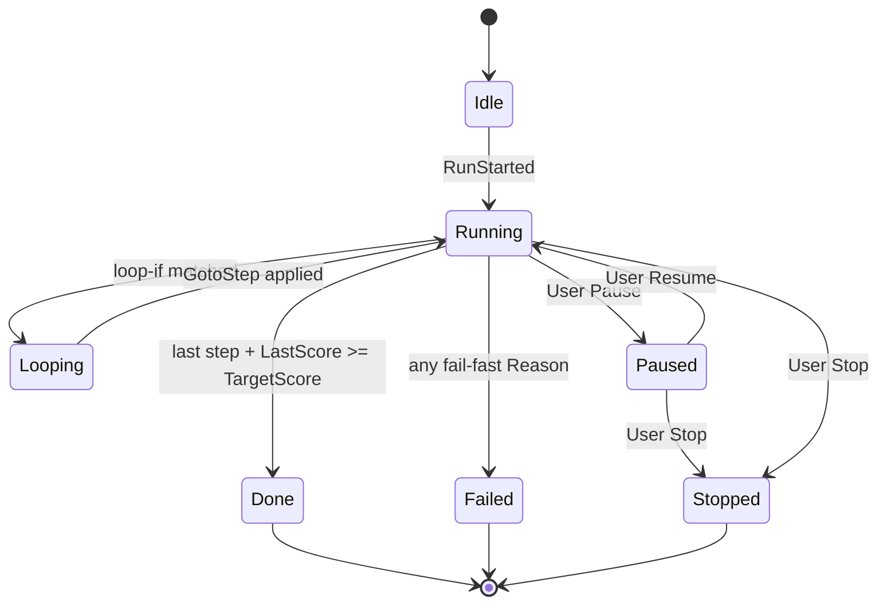

# Run Model — Lifecycle, runId, Resume
**Created:** 2026-06-02
## runId format
```
runId = "<macroSlug>-<yyyymmdd>-<HHmmss>"
```
- Timezone: **the user's local timezone** (`mem://localization/timezone`).
- Generated once at `RunStarted`; never regenerated on resume.
- Example: `spec-tighten-cycle-20260602-094312`.
## Lifecycle states

| State    | `LastEvent`           | `chrome.storage.local` persisted? |
|----------|-----------------------|-----------------------------------|
| Idle     | none                  | no                                |
| Running  | `StepStarted/Completed` | yes (after every step)          |
| Paused   | `RunPaused`           | yes                               |
| Looping  | `LoopEntered`         | yes                               |
| Done     | `RunFinished`         | yes (TTL 7 days)                  |
| Failed   | `RunFailed`           | yes (TTL 7 days)                  |
| Stopped  | `RunStopped`          | yes (TTL 7 days)                  |
## SW-restart resume contract
1. On every state transition, write `MacroRunState.<runId>` to
   `chrome.storage.local`. Identity-only mapping — **no** PascalCase rewrite
   (`mem://constraints/no-storage-pascalcase-migration`).
2. On background service worker boot:
   - Read all `MacroRunState.*` keys.
   - For each `state.Status === "Running" | "Paused"` and
     `now - state.UpdatedAt < MaxStaleMs (default 10 min)` → re-attach to the
     originating tab if still open; otherwise transition to `Paused` and
     surface a toast.
3. Stale runs (`> MaxStaleMs`) are auto-`Paused`; user must Resume or Stop.
4. **No automatic retry** of failed steps (`mem://constraints/no-retry-policy`).
## Persisted shape
```ts
type MacroRunState = {
  RunId: string;
  MacroSlug: string;
  TabId: number;
  Status: "Running" | "Paused" | "Done" | "Failed" | "Stopped";
  CurrentStep: number;     // 1-based
  LoopCount: number;
  LastScore: number | null;
  Variables: Record<string, string | number | boolean>;
  StartedAt: string;       // ISO 8601, the user's local timezone
  UpdatedAt: string;
  LastReason?: string;
  LastReasonDetail?: string;
};
```
Storage key: `MacroRunState.<RunId>`. TTL pruning happens lazily on next boot.
See [`06-storage-contract.md`](./06-storage-contract.md) for the full key map.
