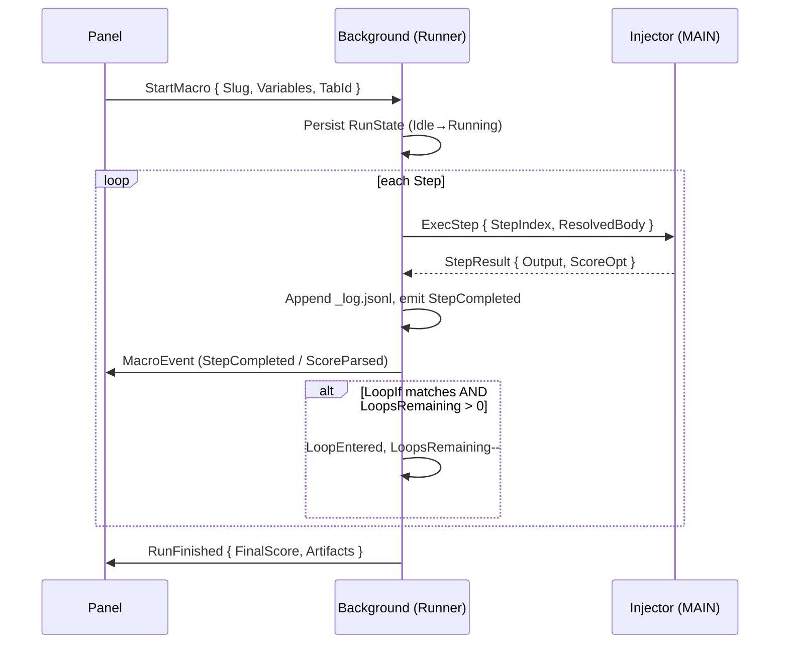

# Engine Architecture

## Modules

```
src/prompts/engine/
├── runner.ts          # state machine driver
├── state-store.ts     # chrome.storage.local persistence + rehydration
├── interpolator.ts    # {{ Var }} resolver (5-tier waterfall)
├── score-parser.ts    # extracts score: NN/100
├── audit-writer.ts    # writes spec/audit/<runId>/...
├── message-bus.ts     # typed panel↔background↔injector messages
├── watchdog.ts        # per-step + total-run + loop-count timeouts
├── event-stream.ts    # MacroEvent union emitter
└── index.ts           # public API
```

## Process boundaries

| Context | Role |
|---------|------|
| **Panel (React)** | UI, dispatches `StartMacro`, renders `MacroEvent` stream |
| **Background SW** | Owns runner state, persistence, watchdog, audit writes |
| **MAIN-world injector** | Executes per-step actions (DOM, clipboard, prompt send) |

## Sequence (happy path)



## Public API (`engine/index.ts`)

```ts
export interface EngineApi {
  start(req: StartMacroRequest): Promise<RunId>;
  pause(runId: RunId): Promise<void>;
  resume(runId: RunId): Promise<void>;
  stop(runId: RunId, reason: string): Promise<void>;
  subscribe(runId: RunId, listener: (e: MacroEvent) => void): Unsubscribe;
  getState(runId: RunId): Promise<RunState>;
}
```

All types are fully designed (no `unknown` outside `CaughtError`). Persistence keys, message shapes, and event union are defined in dedicated specs (61–70).
