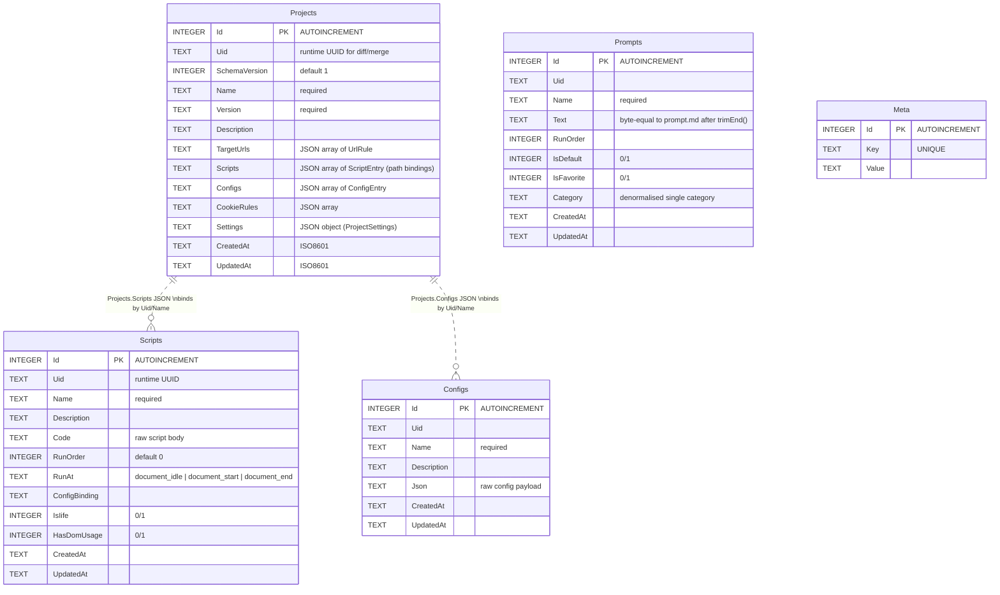
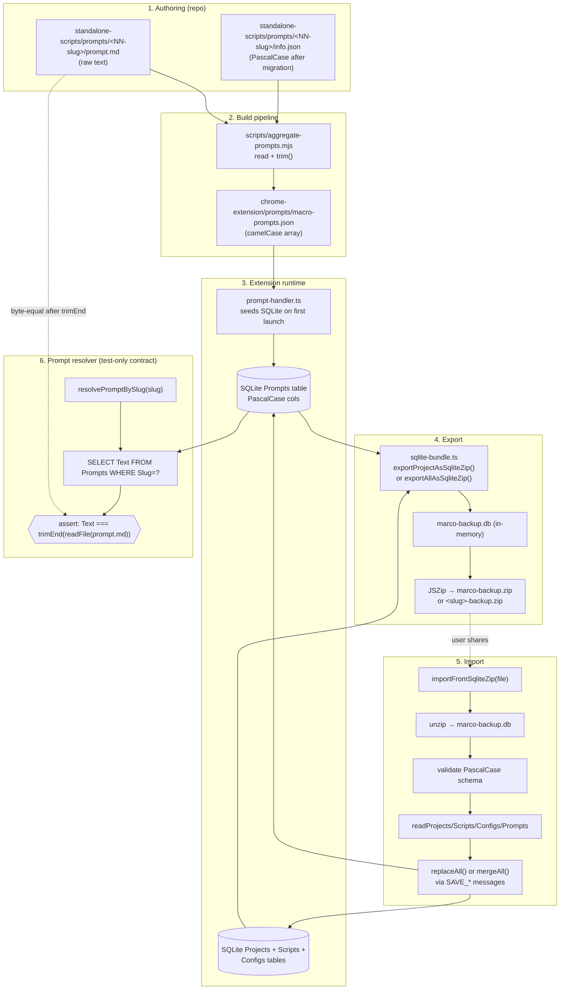

# 30-02 — Import/Export ERD & Flow

**Status**: Spec — pending review.
**Last updated**: 2026-04-24.
**Diagrams**: rendered Mermaid sources in `/mnt/documents/`:
- `import-export-erd.mmd` — real SQLite schema in the export bundle.
- `import-export-flow.mmd` — full pipeline (authoring → SQLite → zip → import → resolver).

---

## 1. ERD — what's actually inside `marco-backup.db`

> **Implicit relationships**: `Projects.Scripts` (JSON array) holds path/UID strings that resolve against the `Scripts` library table at runtime. There is no FK enforced by SQLite. The export preserves both halves; the import re-binds them by `Uid` or `Name`.

> **Out of scope for v1 export**: `PromptsCategory`, `PromptsToCategory` (runtime-only; multi-category links are flattened into `Prompts.Category` on export — flagged in `01-rca.md` §5.3).

## 2. Flow — full pipeline

## 3. Reading the diagrams

- **ERD** — every box is a real PascalCase table that ships in `marco-backup.db`. Dotted `||..o{` relationships are JSON-blob bindings (not enforced FKs).
- **Flow** — six numbered subgraphs map to the six stages. Stage 6 is the **prompt-resolver round-trip**: the test asserts the path from `prompt.md` (stage 1) all the way through stages 2-5 lands back as the same bytes.

## 4. Where the diagrams live

The two `.mmd` files are emitted to `/mnt/documents/` so you can preview them inline:

- `<presentation-artifact path="import-export-erd.mmd" mime_type="text/vnd.mermaid"></presentation-artifact>`
- `<presentation-artifact path="import-export-flow.mmd" mime_type="text/vnd.mermaid"></presentation-artifact>`

(The artifact tags are emitted at the end of the chat reply, not inside this spec doc.)
