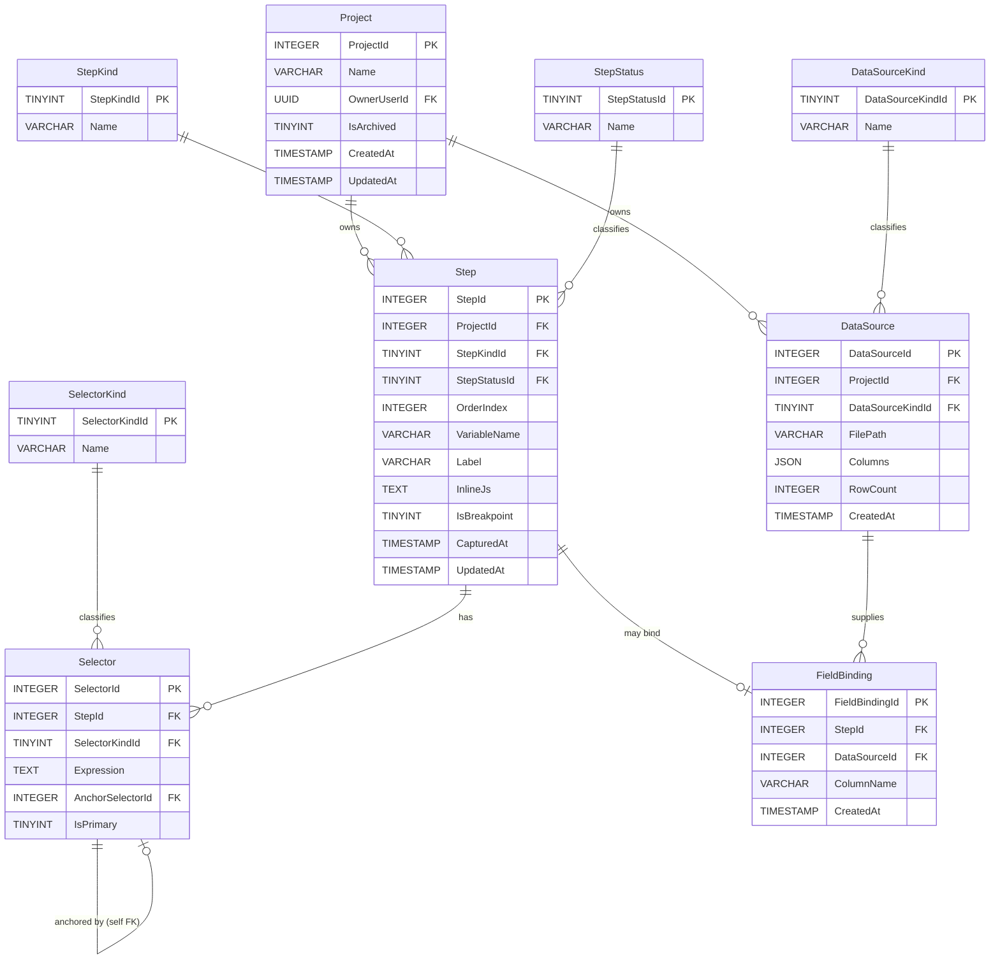

# ERD — Macro Recorder

**Version:** 1.0.0
**Updated:** 2026-04-26
**Phase:** 03 (Data Model Design)
**Source of Truth:** [`./03-data-model.md`](./03-data-model.md)

---

## Diagram

---

## Cardinality Notes

| Relationship | Cardinality | Why |
|---|---|---|
| `Project` → `DataSource` | 1 : 0..n | A Project may have 0+ data sources |
| `Project` → `Step` | 1 : 0..n | A Project's Steps |
| `Step` → `Selector` | 1 : 1..n | Each Step has at least one (`IsPrimary = 1`); may have additional fallback selectors |
| `Step` → `FieldBinding` | 1 : 0..1 | At most one binding per Step (UNIQUE on `FieldBinding.StepId`) |
| `Selector` → `Selector` | 0..1 : 0..n | Self-FK; only `XPathRelative` rows set `AnchorSelectorId` |
| `DataSource` → `FieldBinding` | 1 : 0..n | A DataSource column may be referenced by many Steps |

---

## Cascade Rules

| Parent | Child | On Delete |
|---|---|---|
| `Project` | `Step`, `DataSource` | `CASCADE` |
| `Step` | `Selector`, `FieldBinding` | `CASCADE` |
| `DataSource` | `FieldBinding` | `RESTRICT` (must remove bindings before deleting source) |
| `Selector` (anchor) | `Selector` (dependent) | `SET NULL` (dependent falls back to full XPath at replay) |

---

## Cross-References

| Reference | Location |
|---|---|
| Full schema | [`./03-data-model.md`](./03-data-model.md) |
| Mermaid diagram standards | `../../docs/diagrams/` (see existing `*.mmd` for style) |
| Diagram visual standards memory | `mem://style/diagram-visual-standards` |
