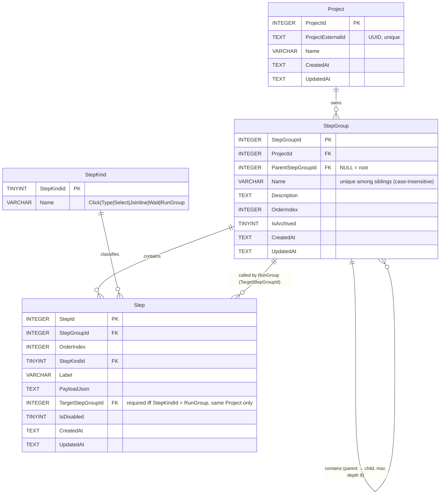

# Step Group Library — ERD

**Version:** 1.0.0
**Updated:** 2026-04-26
**Companion to:** [`./16-step-group-library.md`](./16-step-group-library.md)

**Invariants enforced in DB**

- `TrgStepGroupNoSelfParent` — a group cannot be its own parent.
- `TrgStepGroupSameProjectParent` — parent must belong to same Project.
- `TrgStepGroupMaxDepth8` — reject inserts that produce depth ≥ 9.
- `CkStepRunGroupTarget` — `TargetStepGroupId` is `NOT NULL` iff the
  step is a `RunGroup`, else must be `NULL`.
- `TrgStepRunGroupSameProject` — `TargetStepGroupId`'s project must
  match the calling group's project (no cross-project calls).

**Invariants enforced in runtime (`StepLibraryRunner`)**

- `RunGroupCycle` — a group already on the active call stack cannot be
  re-entered.
- `RunGroupDepthExceeded` — call depth > 16 → fail.
