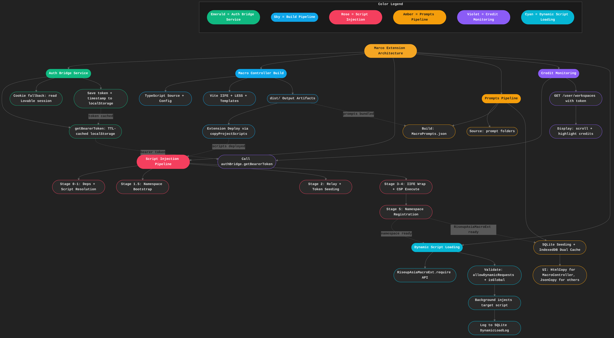
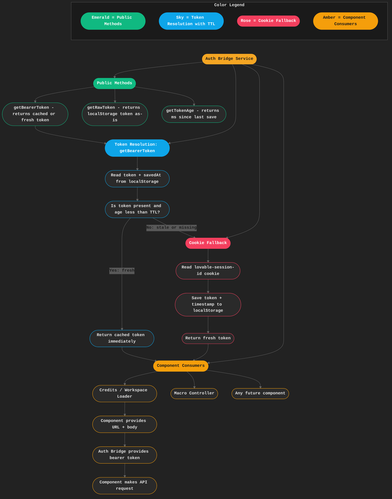
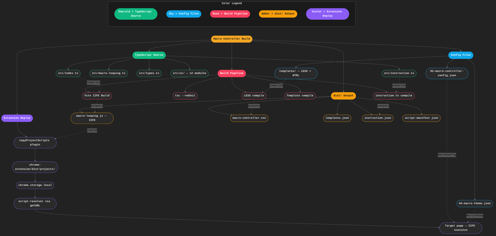
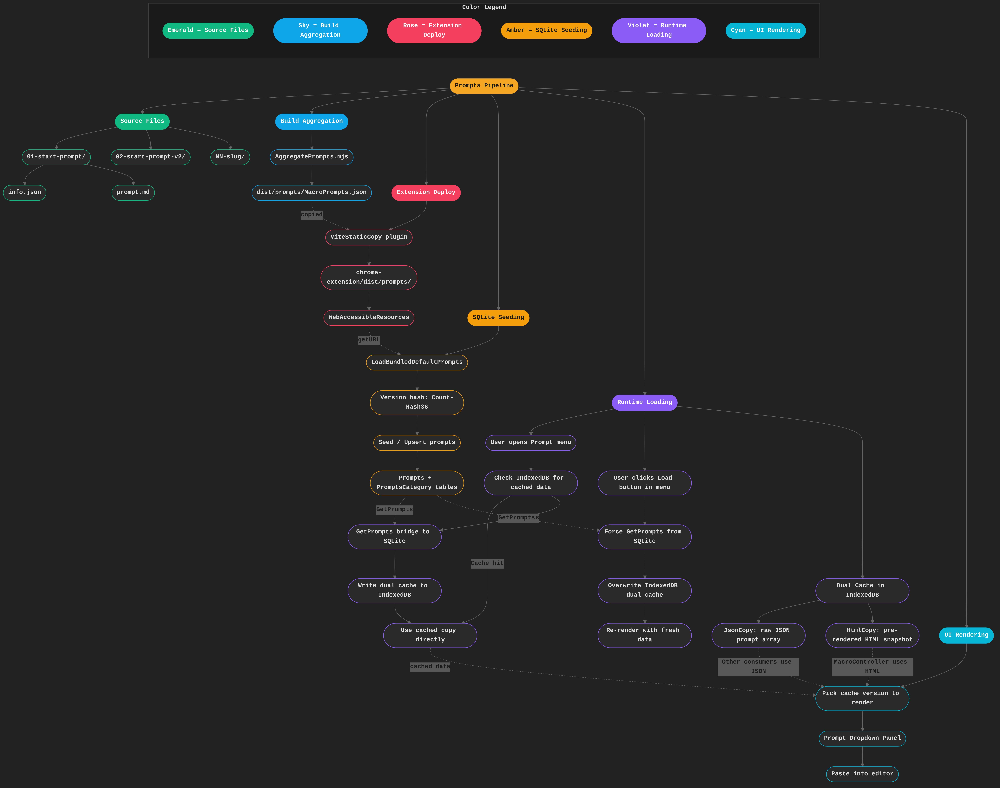
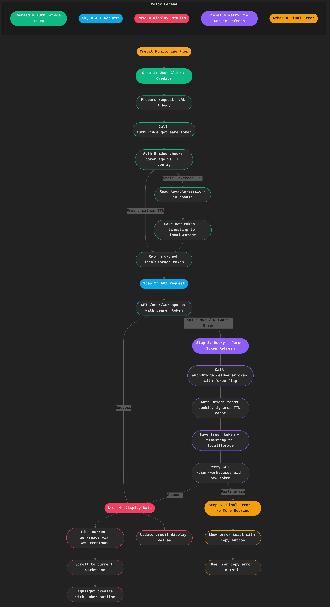
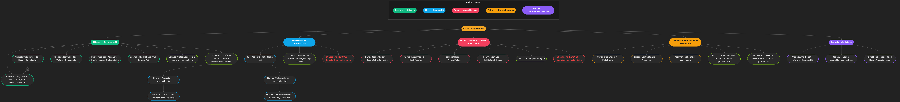
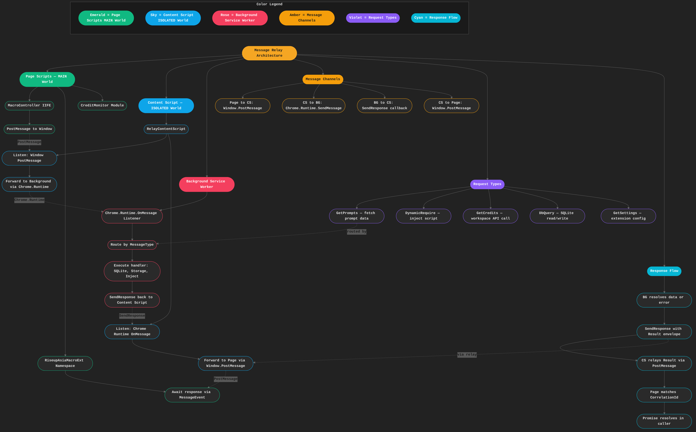
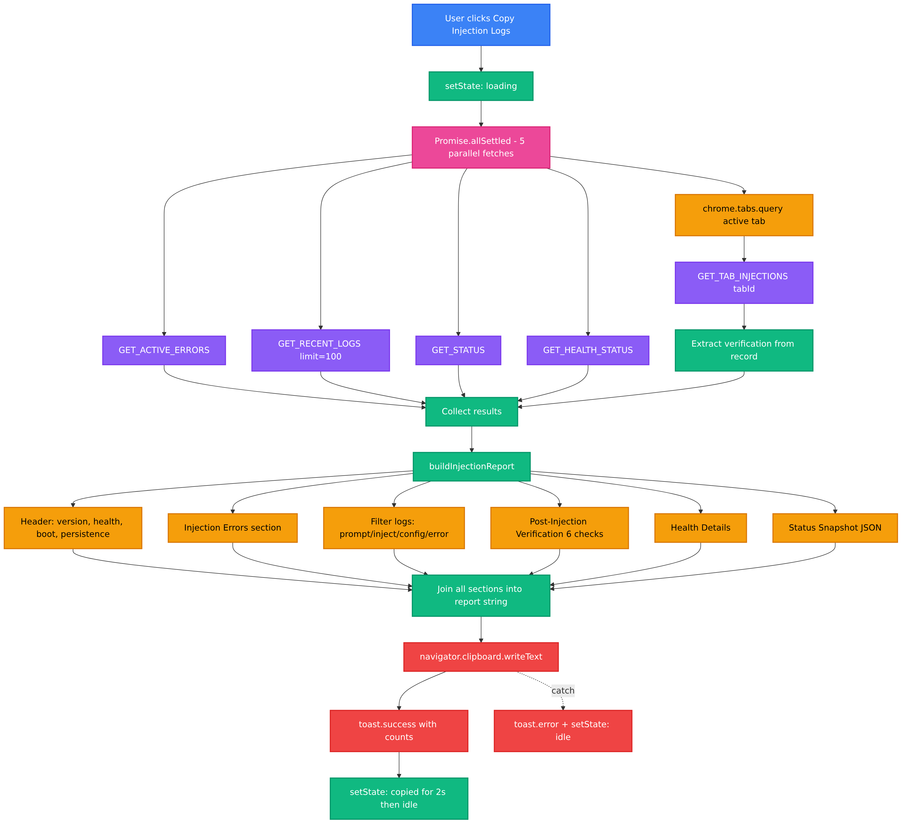

# Diagram Index — Macro Controller Architecture

> All diagrams follow the [XMind-inspired dark-mode standard](../../../spec/21-app/04-design-diagrams/mermaid-design-diagram-spec/01-diagram-spec/diagram-standards.md).  
> Source `.mmd` files live alongside this index; rendered PNGs are in `images/`.

## Table of Contents

1. [Master Architecture Overview](#1-master-architecture-overview) — High-level map of all subsystems and cross-system data flow
2. [Auth Bridge Waterfall](#2-auth-bridge-waterfall) — Token resolution via localStorage, cookie fallback, and TTL caching
3. [Script Injection Pipeline](#3-script-injection-pipeline) — 7-stage lifecycle from dependency resolution to dynamic loading
4. [Macro Controller Build](#4-macro-controller-build) — Vite IIFE compilation and Chrome extension deployment
5. [Prompts Pipeline](#5-prompts-pipeline) — Markdown source to SQLite seeding to runtime SWR loading
6. [Credit Monitoring Flow](#6-credit-monitoring-flow) — Auth pre-flight, API request, and UI display logic
7. [Data Storage Schema](#7-data-storage-schema) — SQLite, IndexedDB, localStorage, and chrome.storage layers
8. [Extension Lifecycle](#8-extension-lifecycle) — Install through page injection to runtime execution
9. [Message Relay Architecture](#9-message-relay-architecture) — PostMessage and Chrome.Runtime channels between page, CS, and background
10. [Injection Pipeline Workflow](#10-injection-pipeline-workflow) — Full Run Scripts pipeline from click to page execution
11. [Copy Injection Logs Workflow](#11-copy-injection-logs-workflow) — Copy button data gathering and report generation
12. [Auth Token Seeding Workflow](#12-auth-token-seeding-workflow) — Extension boot to bearer token resolution and seeding
13. [Message Relay Workflow](#13-message-relay-workflow) — Full request/response and broadcast flow through the 3-tier relay
14. [Prompts Pipeline Workflow](#14-prompts-pipeline-workflow) — Markdown source to SQLite seeding to dual-cache runtime rendering

---

## 1. Master Architecture Overview

**File:** [`master-architecture-overview.mmd`](master-architecture-overview.mmd)  
**Image:** [`images/master-architecture-overview.png`](images/master-architecture-overview.png)

Top-level map of every major subsystem — Auth Bridge, Build Pipeline, Script Injection, Prompts Pipeline, Credit Monitoring, and Dynamic Script Loading — with cross-system data-flow links showing how tokens, scripts, and prompts move between layers.

---

## 2. Auth Bridge Waterfall

**File:** [`auth-bridge-waterfall.mmd`](auth-bridge-waterfall.mmd)  
**Image:** [`images/auth-bridge-waterfall.png`](images/auth-bridge-waterfall.png)

Details the `authBridge` service: public methods (`getBearerToken`, `getRawToken`, `getTokenAge`), TTL-based token resolution from localStorage, cookie fallback from the Lovable session, and how downstream consumers (Credits, Macro Controller) obtain bearer tokens.

---

## 3. Script Injection Pipeline

**File:** [`script-injection-pipeline.mmd`](script-injection-pipeline.mmd)  
**Image:** [`images/script-injection-pipeline.png`](images/script-injection-pipeline.png)

The full 7-stage injection lifecycle: dependency resolution → script resolution → namespace bootstrap → relay & token seeding → IIFE wrap & CSP execute → namespace registration → dynamic loading at runtime via `RiseupAsiaMacroExt.require()`.

---

## 4. Macro Controller Build

**File:** [`macro-controller-build.mmd`](macro-controller-build.mmd)  
**Image:** [`images/macro-controller-build.png`](images/macro-controller-build.png)

Build pipeline from TypeScript source and config files through Vite IIFE compilation, LESS stylesheets, and template compilation, producing `dist/` artifacts that are deployed into the Chrome extension via the `copyProjectScripts` plugin.

---

## 5. Prompts Pipeline

**File:** [`prompts-pipeline.mmd`](prompts-pipeline.mmd)  
**Image:** [`images/prompts-pipeline.png`](images/prompts-pipeline.png)

End-to-end prompt flow: source markdown files → build aggregation into `MacroPrompts.json` → extension deploy via `ViteStaticCopy` → SQLite seeding with version hashing → runtime loading from IndexedDB dual cache (JsonCopy + HtmlCopy) on menu open, with a manual Load button to force-refresh from SQLite. MacroController uses the pre-rendered HtmlCopy to skip rendering loops; other consumers use JsonCopy.

---

## 6. Credit Monitoring Flow

**File:** [`credit-monitoring-flow.mmd`](credit-monitoring-flow.mmd)  
**Image:** [`images/credit-monitoring-flow.png`](images/credit-monitoring-flow.png)

User-triggered credit check: obtain bearer token via `authBridge` → single API request to `/user/workspaces` → display results (find workspace, scroll, highlight credits) or show error toast with copy button. No retry logic.

---

## 7. Data Storage Schema

**File:** [`data-storage-schema.mmd`](data-storage-schema.mmd)  
**Image:** [`images/data-storage-schema.png`](images/data-storage-schema.png)

Maps every storage layer: SQLite (Prompts, PromptsCategory, ProjectConfig, Deployments), IndexedDB client cache (prompts + UI snapshots), localStorage (tokens + settings), chrome.storage.local (extension scripts + settings), and cache invalidation flows between layers.

---

## 8. Extension Lifecycle

**File:** [`extension-lifecycle.mmd`](extension-lifecycle.mmd)  
**Image:** [`images/extension-lifecycle.png`](images/extension-lifecycle.png)

Full extension lifecycle from Chrome install through page injection to runtime execution: service worker bootstrap → tab navigation URL matching → auth token seeding → 6-stage script injection → runtime SDK and dynamic loading → user interaction via popup, context menu, and options page.

---

## 9. Message Relay Architecture

**File:** [`message-relay-architecture.mmd`](message-relay-architecture.mmd)  
**Image:** [`images/message-relay-architecture.png`](images/message-relay-architecture.png)

How page scripts (MAIN world), the relay content script (ISOLATED world), and the background service worker communicate: Window.PostMessage bridges the page↔CS gap, Chrome.Runtime.SendMessage bridges CS↔background, with CorrelationId-based response matching for async request/response patterns.

---

## 10. Injection Pipeline Workflow

**File:** [`injection-pipeline-workflow.mmd`](injection-pipeline-workflow.mmd)  
**Image:** [`images/injection-pipeline-workflow.png`](images/injection-pipeline-workflow.png)

**Second revision** — Full injection pipeline from "Run Scripts" click with IndexedDB cache decision gate, 6 stages, and right-side annotations. Key corrections from v1: removed auth bridge/JWT waterfall from token seeding (replaced with simple cookie read + timestamp + expiry), explained CSP with concrete HTTP header example, clarified relay as postMessage↔chrome.runtime bridge with script-ID duplicate prevention, explained IIFE try-catch wrapping with before/after examples, simplified Stage 4 to known working blob injection path + ISOLATED last resort only (removed speculative userScripts fallback), added IndexedDB payload caching to skip Stages 0–3 on cache hit, added explicit UI injection flow showing how script enters the page DOM, and added comprehensive logging at every stage mirrored to DevTools + SQLite. Clarification specs: `spec/21-app/04-design-diagrams/mermaid-design-diagram-spec/01-diagram-spec/injection-pipeline-workflow-clarification-and-correction.md` (v1) and `injection-pipeline-workflow-second-revision-and-correction.md` (v2).

---

## 11. Copy Injection Logs Workflow

**File:** [`copy-injection-logs-workflow.mmd`](copy-injection-logs-workflow.mmd)  
**Image:** [`images/copy-injection-logs-workflow.png`](images/copy-injection-logs-workflow.png)

Copy Injection Logs button workflow: 5 parallel background fetches via Promise.allSettled (errors, logs, status, health, tab injections), report assembly into 6 sections (header, errors, filtered logs, verification, health, status snapshot), clipboard write, and toast feedback. No retry logic — if a fetch fails, the report includes remaining data.

---

## 12. Auth Token Seeding Workflow

**File:** [`auth-token-seeding-workflow.mmd`](auth-token-seeding-workflow.mmd)  
**Image:** [`images/auth-token-seeding-workflow.png`](images/auth-token-seeding-workflow.png)

Full authentication and token seeding flow from 4 trigger sources (extension boot, Run Scripts pipeline, cookie change, tab navigation) through the core 2-tier resolution: Tier 1 scans tab localStorage for Supabase JWTs (`sb-*-auth-token`), Tier 2 reads session cookies and only seeds if the value is a real JWT (`eyJ...` with 3 segments). Raw opaque cookies are never seeded. On cookie change, the cookie watcher reseeds all platform tabs and broadcasts TOKEN_UPDATED/TOKEN_EXPIRED. Downstream consumers (authBridge, Macro Controller, Credit Monitor) read from localStorage with TTL caching.

---

## 13. Message Relay Workflow

**File:** [`message-relay-workflow.mmd`](message-relay-workflow.mmd)  
**Image:** [`images/message-relay-workflow.png`](images/message-relay-workflow.png)

End-to-end message relay workflow: page scripts (MacroController or Marco SDK) post messages via `window.postMessage` → content script relay validates source (`marco-controller` or `marco-sdk`), checks against the ALLOWED_TYPES whitelist (40+ types), enforces rate limiting (100/s) → forwards to background via `chrome.runtime.sendMessage` → background router dispatches to HANDLER_REGISTRY → response flows back through `sendResponse` callback → content script posts back to page with matching `requestId` → caller Promise resolves. Broadcasts (CONFIG_UPDATED, TOKEN_EXPIRED, TOKEN_UPDATED, CONFIG_CHANGED) flow unsolicited from background → content script → page. Guards include duplicate relay sentinel, SDK 15s timeout, and error envelopes for blocked types.

---

## 14. Prompts Pipeline Workflow

**File:** [`prompts-pipeline-workflow.mmd`](prompts-pipeline-workflow.mmd)  
**Image:** [`images/prompts-pipeline-workflow.png`](images/prompts-pipeline-workflow.png)

End-to-end prompt lifecycle workflow: Stage 1 reads markdown source files (info.json + prompt.md per numbered folder); Stage 2 build aggregation via AggregatePrompts.mjs validates, renders markdown to HTML, and outputs MacroPrompts.json with a Count-Hash36 version hash; Stage 3 deploys via ViteStaticCopy into chrome-extension dist/prompts/ as a web-accessible resource; Stage 4 SQLite seeding on install/update uses the version hash to skip unchanged data, upserts into Prompts + PromptsCategory tables with both JsonCopy and HtmlCopy; Stage 5 runtime loading on user menu open checks IndexedDB dual cache (marco_prompts_cache) first, falls back to GetPrompts bridge → SQLite on cache miss, with manual Load button for force-refresh; Stage 6 UI rendering picks HtmlCopy for MacroController (zero rendering cost) or JsonCopy for other consumers, displays category-tabbed dropdown, and pastes selected prompt into editor with variable resolution.

